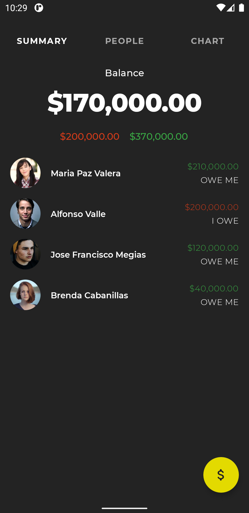
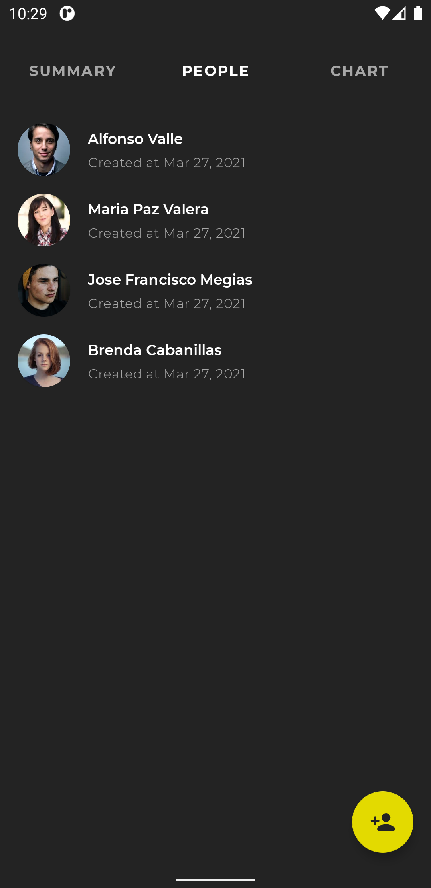
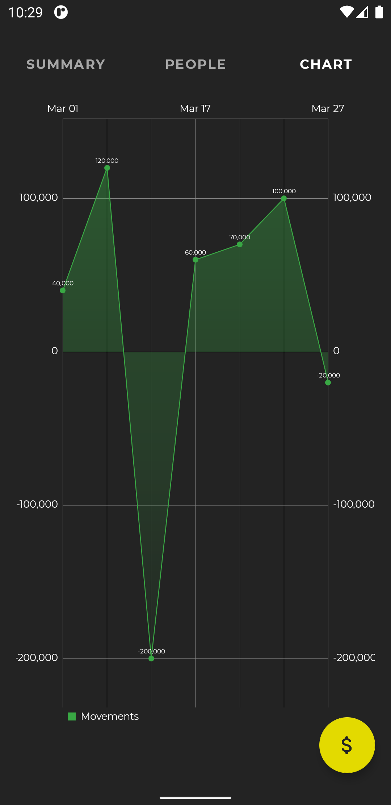
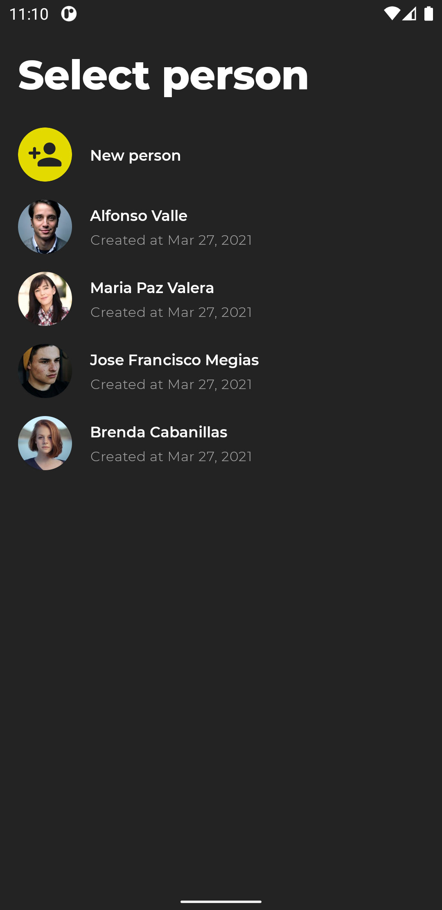
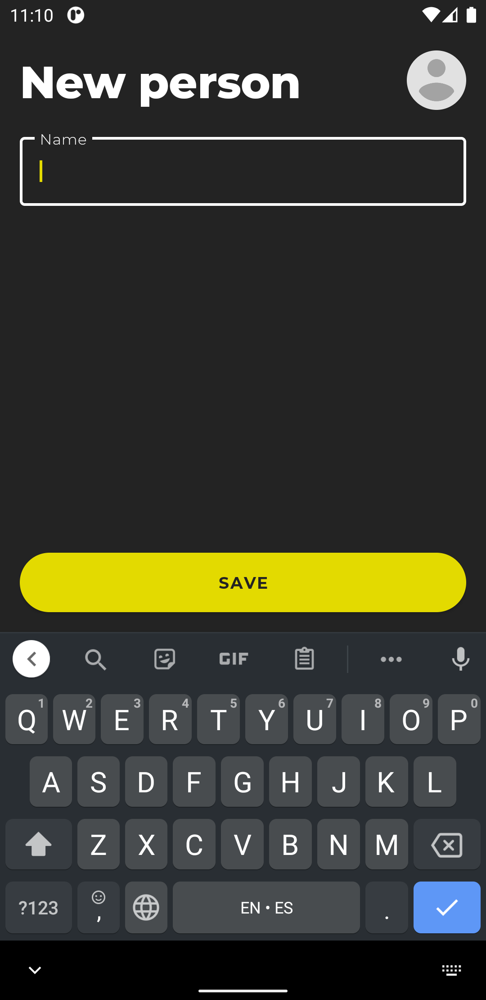
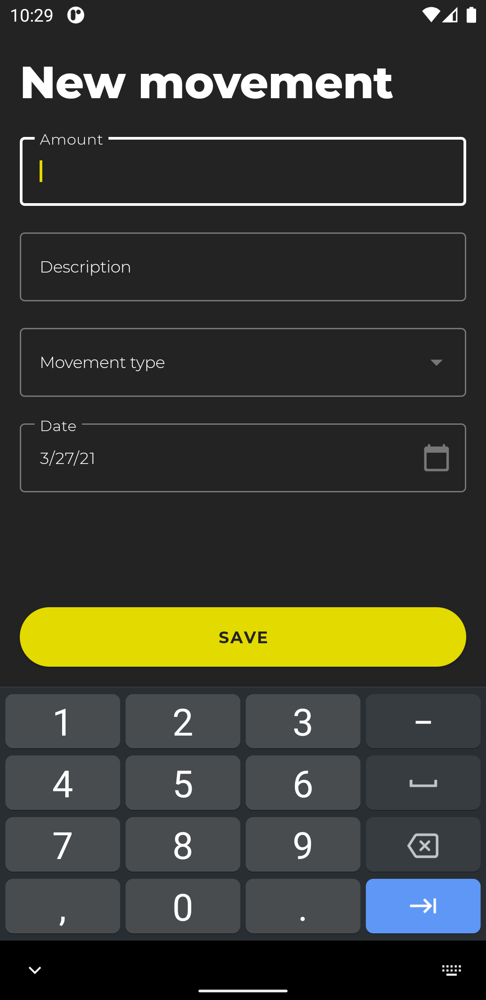
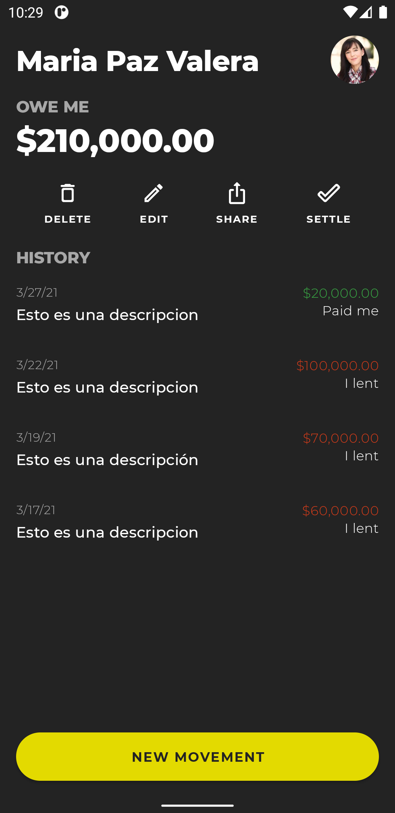
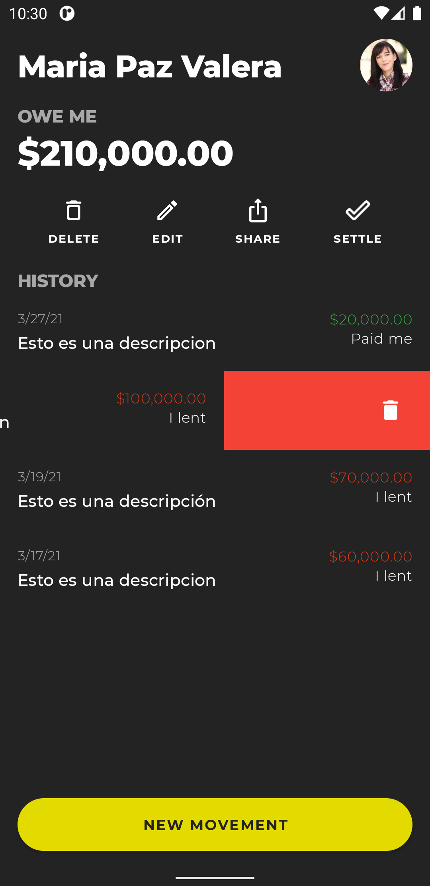
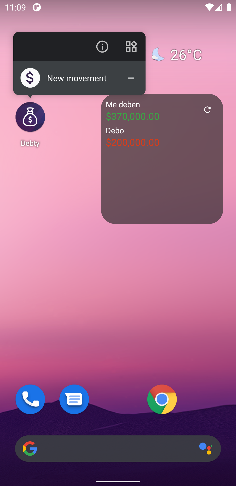

# Debty 2
Android debts management app made with Kotlin.

Download it on [Google Play Store](https://play.google.com/store/apps/details?id=com.fabirt.debty2).

## Features
- Create/Edit/Delete people and movements
- Data persistance with room
- SQL queries with Room
- Theming (light/dark, material components)
- App Shortcuts
- App Widgets
- Swipe to delete
- Undo delete
- Animated vector drawables
- Share content
- Image picker
- Notifications
- In app updates

## Libraries Used
- Android KTX
- Material Design Components
- Kotlin Coroutines
- View Binding
- LiveData
- ViewModel
- Navigation
- Room
- Hilt
- Charts
- Play Core

## Screenshots
|  |  |  |
|----------|:-------------:|:-------------:|

|  |  |  |
|----------|:-------------:|:-------------:|

|  |   |  |
|----------|:-------------:|:-------------:|
